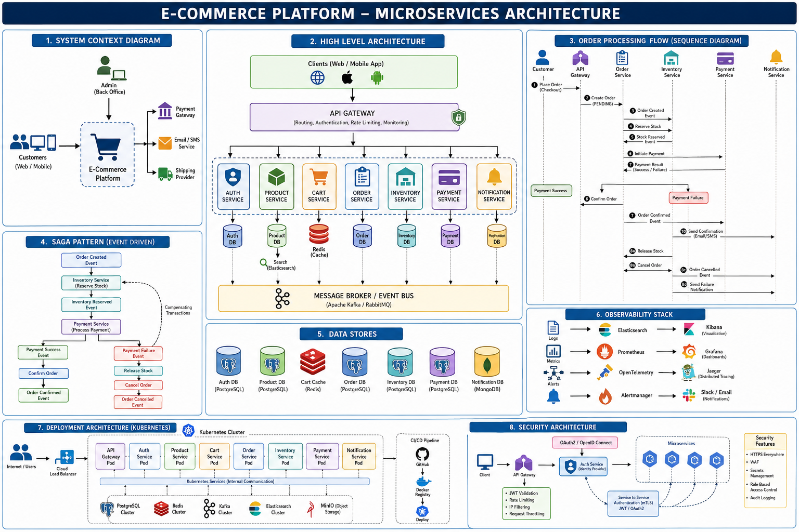

# E-Commerce Platform - Spring Boot Microservices

This project is generated from the attached architecture diagram. It contains a Spring Boot microservices skeleton for:

## Architecture Diagram



- API Gateway
- Auth Service
- Product Service
- Cart Service
- Order Service
- Inventory Service
- Payment Service
- Notification Service
- Shared event contracts in `common-events`

## Architecture Mapping

| Diagram Area | Code |
| --- | --- |
| API Gateway | `api-gateway` with route definitions and rate-limit ready config |
| Microservices | One Spring Boot module per service |
| Saga pattern | `order-service`, `inventory-service`, `payment-service`, and `notification-service` exchange event records from `common-events` |
| Data stores | Services use in-memory repositories for local development; properties show where PostgreSQL/Redis/MongoDB/Kafka plug in |
| Observability | Actuator endpoints enabled for health, metrics, and Prometheus scraping |
| Security | Gateway forwards JWT-like bearer tokens; `auth-service` issues and validates demo tokens |

## Build

```powershell
mvn clean package
```

## Docker Build

The root `Dockerfile` builds one service at a time with the `SERVICE` build argument.

```powershell
docker build --build-arg SERVICE=api-gateway -t ghcr.io/kvsiva/ecommerceapp-api-gateway:latest .
docker build --build-arg SERVICE=auth-service -t ghcr.io/kvsiva/ecommerceapp-auth-service:latest .
```

## Run One Service

```powershell
mvn -pl auth-service spring-boot:run
```

## Suggested Ports

| Service | Port |
| --- | --- |
| API Gateway | 8080 |
| Auth | 8081 |
| Product | 8082 |
| Cart | 8083 |
| Order | 8084 |
| Inventory | 8085 |
| Payment | 8086 |
| Notification | 8087 |

## Kubernetes Deploy

The `k8s` folder contains Kustomize-ready manifests:

```powershell
kubectl apply -k k8s
kubectl get pods -n ecommerce
kubectl get svc api-gateway -n ecommerce
```

The gateway is exposed as a `LoadBalancer`. For local clusters such as Minikube or Docker Desktop, use the external IP/localhost behavior provided by your cluster.

## GitHub Actions Pipeline

The workflow in `.github/workflows/ci-cd.yml` runs:

1. Maven build and package.
2. Docker image build and push to GitHub Container Registry on `main`.
3. Optional Kubernetes deployment when manually triggered.

For deployment, add this GitHub repository secret:

```text
KUBE_CONFIG
```

`KUBE_CONFIG` should contain the kubeconfig for the target cluster. Images are published as:

```text
ghcr.io/kvsiva/ecommerceapp-api-gateway:latest
ghcr.io/kvsiva/ecommerceapp-auth-service:latest
ghcr.io/kvsiva/ecommerceapp-product-service:latest
```

## Example Flow

1. Register/login through `auth-service`.
2. Search products in `product-service`.
3. Add products to a cart in `cart-service`.
4. Create an order in `order-service`.
5. Reserve stock in `inventory-service`.
6. Process payment in `payment-service`.
7. Confirm/cancel order and notify the user.

The event publisher logs events even when Kafka is not available, so the services are easy to run locally before wiring full infrastructure.
